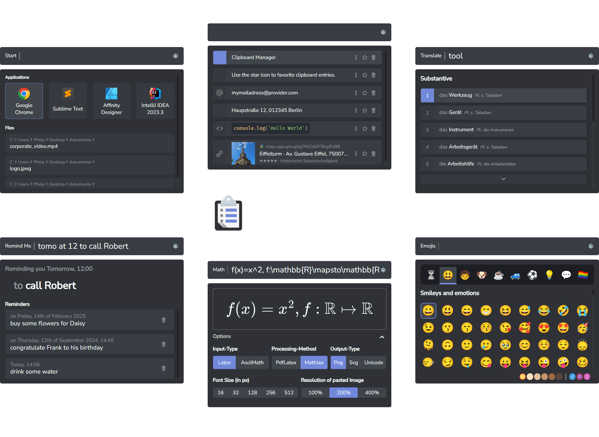

Smartclip is a versatile tool designed to streamline workflows by offering quick access to various utilities through a user-friendly interface. Similar to popular application launchers like Apple's Spotlight, Celebro, and Albert, Smartclip goes beyond basic search functions by integrating a range of specialized plugins. These plugins empower users to efficiently manage clipboard content, handle mathematical expressions, launch applications, translate text, and much more, all with minimal effort. Each plugin is carefully crafted to enhance productivity, making Smartclip a powerful companion for both everyday tasks and more complex workflows.

## Documentation

You can find the Documentation [on the Website](https://muelphil.github.io/smartclip/docs/installation.html)

## Beta
Smartclip is currently in beta, Version 0.9.0 will be valid until 31/12/2024, I will extend the duration based on the feedback.

Smartclip is currently only available for Linux (with restrictions, see section Linux) and Window, but there is a Mac version planned.

I greatly appreciate any kind of feedback, feature requests and bug reports. To do so please create an [Github Issue](https://github.com/muelphil/smartclip/issues).

## Installation

To install Smartclip head to [the Website](https://muelphil.github.io/smartclip/) or the [Releases Page of the Github Repository](https://github.com/muelphil/smartclip/releases) and download the latest installer. If you are on Windows, download the `.exe` file, on Linux download the `.deb` file. As of now, the source code for Smartclip is not publicly available.

### Windows

Simply follow the instructions of the Installer.

### Linux

Please note that this tool will only work under non wayland display managers, like X11. To check if you are running on wayland type `echo $XDG_SESSION_TYPE` into your terminal, in case of running on wayland display manager this will yield `wayland`.

The Reason is that wayland prohibits sending keystrokes across windows, which makes it impossible to send a paste event, which is necessary for pasting clipboard entries, translations, and emojis.

For Ubuntu, right-click the `.deb` installer file and choose `Open with Software Install`. Depending on your operating system version, this may vary.

For other Linux distributions please consult the Internet on how to install `.deb` files.

[//]: # ()
[//]: # (## Installation)

[//]: # (Please note the smartclip will require some time on the first startup to load your installed applications. Smartclip will start hidden, but you can open it via the Taskbar &#40;Rightclick -> Show&#41; or via the default keycombinations:)

[//]: # ()
[//]: # (- `Super` + `Space`: Start Plugin)

[//]: # (- `Super` + `V`: Clipboard Plugin)

[//]: # (- `Super` + `.`: Emoji Picker Plugin)

[//]: # (- `Ctr` + `Shift` + `L`: Language Plugin)

[//]: # ()
[//]: # (### Windows)

[//]: # ()
[//]: # (Please be aware of a bug related to the global hotkeys: When locking your display with Super + L, this will currently hang the Windows key after logging back in. To resolve that just tap the Windows key once.)

[//]: # ()
[//]: # (### Linux)

[//]: # (Please note that this tool will only work under non wayland display managers, like X11. To check if you are running on wayland type `echo $XDG_SESSION_TYPE` into your terminal, in case of running on wayland display manager this will yield `wayland`.)

[//]: # ()
[//]: # (Reason is that wayland prohibits sending keystrokes across windows, which makes it impossible to send a paste event, which is necessary for pasting clipboard entries, translations and emojis.)

[//]: # ()
[//]: # (Please also note that key combinations work via setting custom gnome settings key combinations. If you want to override system behaviour, you need to go to `Settings -> Keybaord -> View and Customize Shortcuts` and remove the default system behaviour attached to the key combinations you want to)

[//]: # ()
[//]: # (## Plugins)

[//]: # ()
[//]: # (The core of Smartclip is the Prompt line, over which the user interacts with the application. Smartclip furthermore consists of multiple plugins. One of these Plugins &#40;by default the Clipboard&#41; is the basic Plugin, that will show up whenever you open Smartclip using the hotkey &#40;by default `ctrl+shift+V`&#41;. You can open the other plugins by typing the id of Plugin &#40;for example `start` for the Start Plugin&#41;)

[//]: # (followed by a Space. This will open the Plugin. To get back, simply press `backspace`.)

[//]: # ()
[//]: # (The Settings can be opened the same way: type `settings` followed by a Space, or alternatively press the little wheel icon on the right side of the prompt line.)

[//]: # ()
[//]: # (In the following there is an overview of the different plugins, their ids and their functionality.)

[//]: # ()
[//]: # (### Start &#40;`start`&#41;)

[//]: # ()
[//]: # (![Start Plugin]&#40;./assets/images/Plugin_Start.png&#41;)

[//]: # ()
[//]: # (The Start Plugin allows users to quickly search for and start installed applications, as well as locate files within predefined, indexed directories. This plugin streamlines)

[//]: # (workflow by providing fast and efficient access to essential programs and documents.)

[//]: # ()
[//]: # (- search local applications)

[//]: # (    - smartclip will take longer on first start for searching for all applications and caching the icons)

[//]: # (    - icons are currently buggy &#40;work in progress&#41;)

[//]: # (- special actions)

[//]: # (    - shutdown, sleep, restart, hibernate)

[//]: # (- set directories to index in the settings to index directories and search for files in these directories)

[//]: # (    - there is a max depth and a max amount of files currently hardcoded &#40;work in progress&#41;)

[//]: # ()
[//]: # (### Clipboard &#40;`clip` - default Plugin!&#41;)

[//]: # ()
[//]: # (![Plugin_Clip]&#40;./assets/images/Plugin_Clip.png&#41;)

[//]: # ()
[//]: # (The Clipboard Manager allows users to store and retrieve clipboard entries, enhancing productivity by providing easy access to previously copied items for reuse in text input)

[//]: # (fields.)

[//]: # ()
[//]: # (- stores text copied to the clipboard)

[//]: # (- multiple types of clipboard entries &#40;detected by parsing, clipboard storage or in case of math through generation by smartclip&#41;)

[//]: # (    - plain)

[//]: # (    - math)

[//]: # (    - url)

[//]: # (    - file)

[//]: # (        - folder, file, image file)

[//]: # (    - email)

[//]: # (    - code)

[//]: # (- prepend special keywords for the entry types &#40;file, url, math, image, mail, code&#41; to your query to only search for entries of that specific type)

[//]: # (    - for example `url youtube` - only url entries that include youtube)

[//]: # (- actions based on the type of clipboard entry, use context menu by clicking the 3 dots or by pressing `shift+enter` on the selected entry)

[//]: # (    - for example email entries allow for the action "send email to..." opening your default mail application)

[//]: # (- use `alt+1-9` to paste an entry by position)

[//]: # (- favor entries, so that they get stored for future sessions)

[//]: # ()
[//]: # (### Translator &#40;`tl`&#41;)

[//]: # ()
[//]: # (![Plugin_Translate]&#40;./assets/images/Plugin_Translate.png&#41;)

[//]: # ()
[//]: # (The Translation Plugin simplifies and accelerates translations with a single shortcut key, allowing users to instantly translate and paste words in various languages. This plugin)

[//]: # (enhances efficiency, making translation effortless and seamless.)

[//]: # ()
[//]: # (- displays results sorted by categories &#40;nouns, verbs, object&#41;)

[//]: # (    - use `ctrl+down/up` to jump between categories)

[//]: # (- paste words instantly by pressing enter on a selected word)

[//]: # (- "did you mean..." for when typos happen)

[//]: # (- use `ctrl+shift+L` while highlighting a word in another application to automatically copy the word to Smartclip and search for it, press enter to replace the highlighted word)

[//]: # (  with the result)

[//]: # ()
[//]: # (### Emoji Picker &#40;`emoji`&#41;)

[//]: # (![Plugin_Emoji]&#40;./assets/images/Plugin_Emoji.png&#41;)

[//]: # ()
[//]: # (The Emoji Picker Plugin enables users to effortlessly browse and select emojis, enhancing text input fields with a fun and expressive touch. Seamlessly integrated and easy to use,)

[//]: # (it enriches user interactions within your application.)

[//]: # ()
[//]: # (- use arrow keys to navigate)

[//]: # (- use mouse click or enter to paste selected emoji)

[//]: # (- use alt + enter or alt + mouse click to show alternate versions &#40;emojis with alternate versions have a grey border around them&#41;)

[//]: # (- use shift + enter or shift + mouseclick to store multiple emojis, press delete to remove one emoji from the stack, press enter to paste all the stored emojis)

[//]: # (- search using german or english. The search function uses the suggested words from Whatsapp [that you can find here]&#40;https://web.whatsapp.com/emoji_suggestions/en.json&#41;)

[//]: # (    - for german + english I simply took both, pasted them into the chrome console as JSON objects and used {...en, ...de} to merge them, saving the result to a new file)

[//]: # (- Use the skintone and gender radio buttons to select the corresponding alternate of all emojis that have alternates)

[//]: # ()
[//]: # (### Math &#40;`math`&#41;)

[//]: # ()
[//]: # (![Plugin_Math]&#40;./assets/images/Plugin_Math.png&#41;)

[//]: # ()
[//]: # (The Math Plugin enables users to convert LaTeX input into SVG, PNG, or Unicode math formulas, providing a versatile tool for pasting beautifully rendered mathematical expressions.)

[//]: # (With support for MathJax and PdfLatex &#40;if installed&#41;, this plugin enhances text with precise and visually appealing math content.)

[//]: # ()
[//]: # (- provide a query in a math markup language and press enter to paste the math in the selected format)

[//]: # (- input methods)

[//]: # (    - latex: `f:\mathbb{R}\mapsto\mathbb{R}`)

[//]: # (    - asciimath: `f: RR |-> RR`)

[//]: # (        - for unicode I use a custom translation from latex to ascii that is based on [this specification]&#40;https://asciimath.org/&#41;)

[//]: # (- parsing methods)

[//]: # (    - pdflatex - uses local pdflatex.exe - please make sure it is present!)

[//]: # (    - [MathJax]&#40;https://www.mathjax.org/&#41;)

[//]: # (- output methods)

[//]: # (    - SVG)

[//]: # (    - PNG)

[//]: # (    - Unicode)

[//]: # (- options for selecting the color, the size, the resolution &#40;how many pixels are generated per paste height/width in pixel&#41; and whether to use displaystyle)

[//]: # ()
[//]: # (### Remind me &#40;`rm`&#41;)

[//]: # ()
[//]: # (![Plugin_RemindMe]&#40;./assets/images/Plugin_RemindMe.png&#41;;)

[//]: # ()
[//]: # (The RemindMe Plugin enables users to set reminders effortlessly by typing a date and/or time in natural language followed by a task. This intuitive yet minimalistic plugin)

[//]: # (simplifies task management, ensuring you never miss anything important.)

[//]: # ()
[//]: # (- use query to generate Reminders, that consist of a time and a task)

[//]: # (- use the word "to" to explicitly separate time and task)

[//]: # (- time detects any combination of the following:)

[//]: # (    - keyword `in`)

[//]: # (        - `in 10 mins and 30 seconds`)

[//]: # (        - `in an hour`)

[//]: # (        - `in 4d 30m 20s`)

[//]: # (    - keyword `at`)

[//]: # (        - `at 20`)

[//]: # (        - `at 20:30`)

[//]: # (        - `at 8:30 pm`)

[//]: # (    - time)

[//]: # (        - `20:00`)

[//]: # (        - `8pm`)

[//]: # (        - `8:30pm`)

[//]: # (        - does not detect just `20`, use `at 20` instead)

[//]: # (    - keyword `next`)

[//]: # (        - `next month` &#40;first day of next month&#41;)

[//]: # (        - `next week` &#40;next monday&#41;)

[//]: # (    - weekdays)

[//]: # (        - `monday`, `tuesday`, `wednesday`, `thursday`, `friday`, `saturday`, `sunday`,)

[//]: # (        - sets date to the next occurence of that weekday in the future)

[//]: # (    - tomorrow)

[//]: # (        - `tomo`)

[//]: # (        - `tomorrow`)

[//]: # (    - special times &#40;only when time is not provided in another way&#41;)

[//]: # (        - `morning`: 8:00)

[//]: # (        - `lunch`: 12:00)

[//]: # (        - `noon`: 12:00)

[//]: # (        - `afternoon`: 14:00)

[//]: # (        - `evening`: 17:00)

[//]: # (        - `dinner`: 18:00)

[//]: # (        - `night`: 20:00)

[//]: # (    - dates)

[//]: # (        - `01.01.1970`)

[//]: # (        - `15.4.`)

[//]: # (        - `15.4`)

[//]: # (        - `15.4.25`)

[//]: # (        - `15.4.2025`)

[//]: # (        - `15-4-25`)

[//]: # (        - `15/4/25`)

[//]: # (        - currently not detected: `1 September 22`, `31 Dec 2023`, `2024/12/29`)

[//]: # (- task is anything after the keyword `to`, anything left of the time specification &#40;query from start until first occurence of `to`&#41; after parsing will be prepended to the task)

[//]: # ()
[//]: # (## Work in Progess)

[//]: # ()
[//]: # (- Linux/ Mac Builds)

[//]: # (- build your own plugins)

[//]: # (- create your own themes)