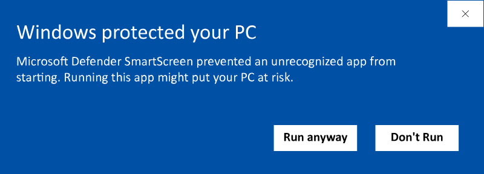
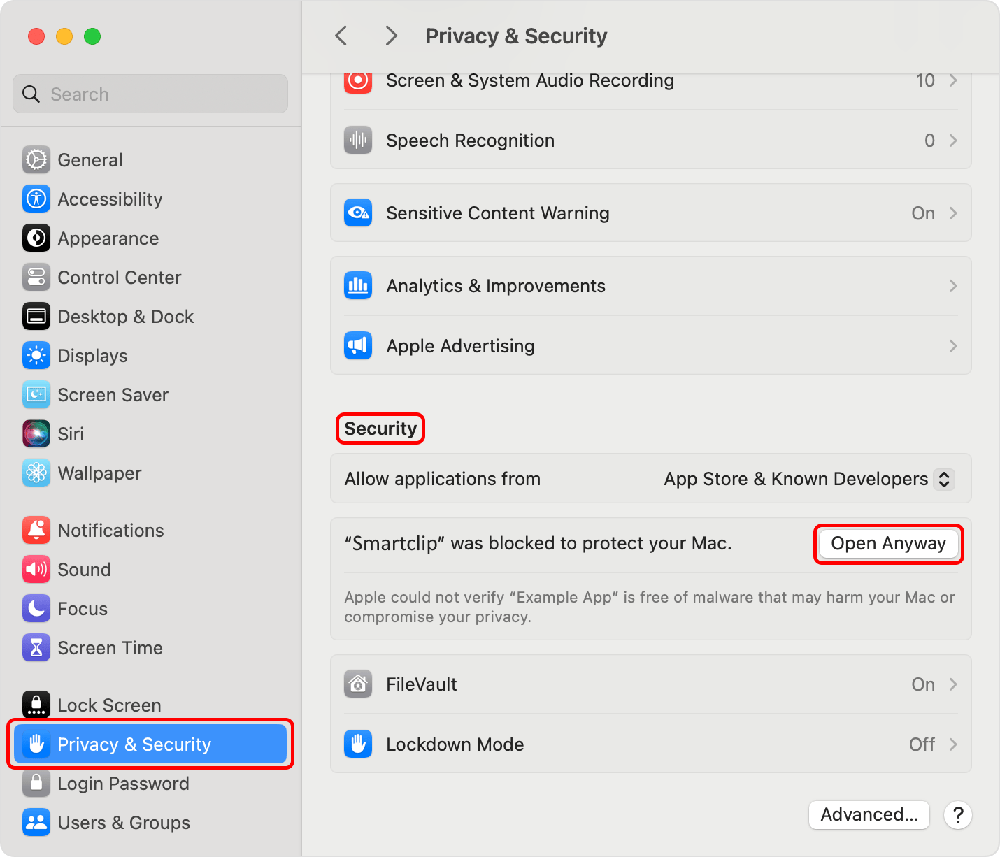
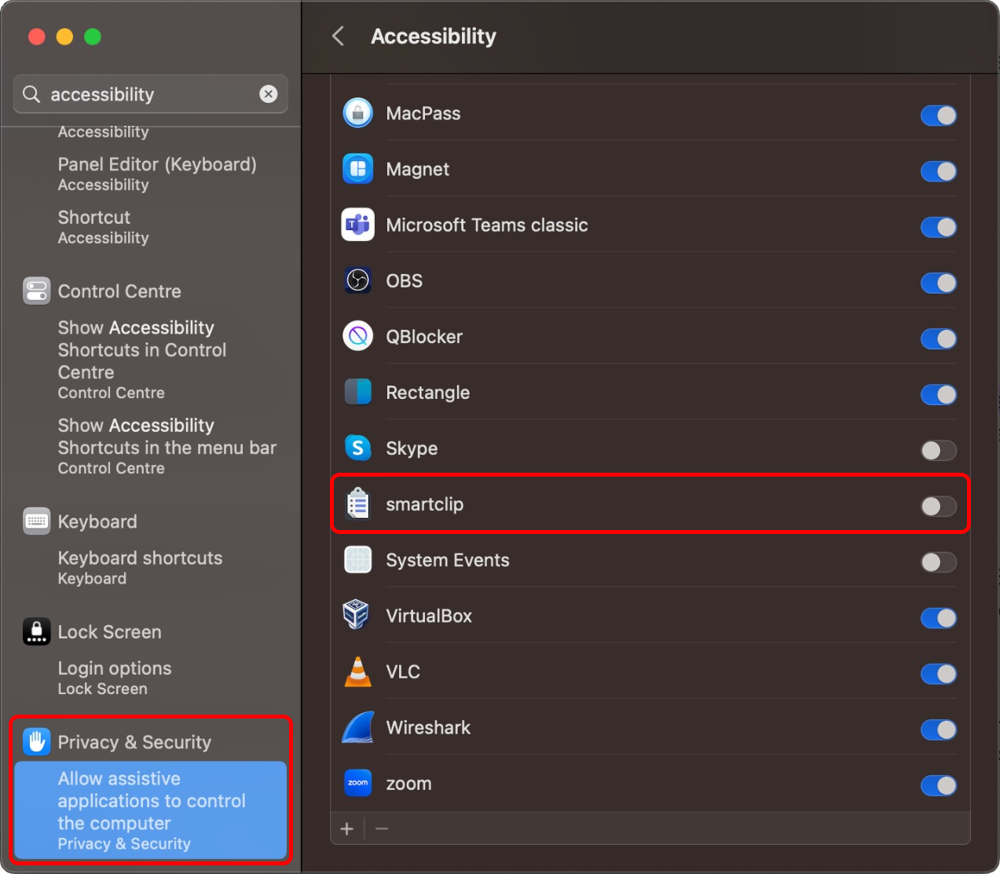

Smartclip is a versatile tool designed to streamline workflows by offering quick access to various utilities through a user-friendly interface. Similar to popular application launchers like Apple's Spotlight, Celebro, and Albert, Smartclip goes beyond basic search functions by integrating a range of specialized plugins. These plugins empower users to efficiently manage clipboard content, handle mathematical expressions, launch applications, translate text, and much more, all with minimal effort. Each plugin is carefully crafted to enhance productivity, making Smartclip a powerful companion for both everyday tasks and more complex workflows.


## Documentation

You can find the Documentation [on the Website](https://muelphil.github.io/smartclip/docs/installation.html)

## Beta
Smartclip is currently in beta, Version 0.9.2 will be valid until 31/03/2025, I will extend the duration based on the feedback.

Smartclip is available for Linux (with restrictions, see section Linux), Window and MacOs.

I greatly appreciate any kind of feedback, feature requests and bug reports. To do so please create an [Github Issue](https://github.com/muelphil/smartclip/issues).

## Installation

By downloading and installing Smartclip, you agree to the [Terms of Agreement](https://github.com/muelphil/smartclip/blob/main/LICENSE).

To install Smartclip head to either the [Website](https://muelphil.github.io/smartclip/) or the [Releases Page of the Github Repository](https://github.com/muelphil/smartclip/releases) and download the latest installer.
- Windows: [`smartclip-0.9.2-windows.exe`](https://github.com/muelphil/smartclip/releases/download/v0.9.2-beta/smartclip-0.9.2-windows.exe)
- Linux: [`smartclip-0.9.2-linux-amd64.deb`](https://github.com/muelphil/smartclip/releases/download/v0.9.2-beta/smartclip-0.9.2-linux-amd64.deb)
- MacOs: [`smartclip-0.9.2-macos.dmg`](https://github.com/muelphil/smartclip/releases/download/v0.9.2-beta/smartclip-0.9.2-macos.dmg)

As of now the source code for Smartclip is not publicly available.

### Windows

Please note that upon installation you will get prompted with a warning:



This will go away after a sufficient number of Windows users have installed Smartclip. The only other way for me to stop this message from coming up is paying somewhere around 1000$ to Microsoft for a license, which is currently not an option.

After clicking "Run anyway..." simply follow the instructions of the Installer.

### Linux

Please note that this tool will only work under non wayland display managers, like X11. To check if you are running on wayland type `echo $XDG_SESSION_TYPE` into your terminal, in case of running on wayland display manager this will yield `wayland`.

The Reason is that wayland prohibits sending keystrokes across windows, which makes it impossible to send a paste event, which is necessary for pasting clipboard entries, translations, and emojis.

For Ubuntu, right-click the `.deb` installer file and choose `Open with Software Install`. Depending on your operating system version, this may vary.

You can also install it via Command line using
```shell
cd ~/Downloads/
sudo dpkg -i ./smartclip-<VERSION_NUMBER>-linux-amd64.deb
```

If you have a previous version of Smartclip installed you can uninstall it using
```shell
sudo dpkg -r smartclip
```

For other Linux distributions please consult the Internet on how to install `.deb` files.

### MacOs

As this app is still in beta and I currently don't have the financial means to pay for an Apple Developer Account, this app isn't signed by Apple.
This means, that for installation you need to bypass the Security Settings:

#### [Open a Mac app from an unknown developer](https://support.apple.com/guide/mac-help/open-a-mac-app-from-an-unknown-developer-mh40616/mac)
1. Attempt to install the App by downloading the .deb file, double clicking it and dragging the Smarclip icon into the Applications folder. MacOs will initially block this.
2. On your Mac, choose `Apple menu  > System Settings`, then click `Privacy & Security`  in the sidebar.
2. Scroll down to Security, find the section notifying you about the attempted installation of Smartclip, then click Open.
3. Click Open Anyway. (This button is available for about an hour after you try to open the app)
5. Enter your login password, then click OK.




You might need to enable Accessibility features on MacOs, which Smartclip uses to send paste events to the system. You can also find this in the System Settings

